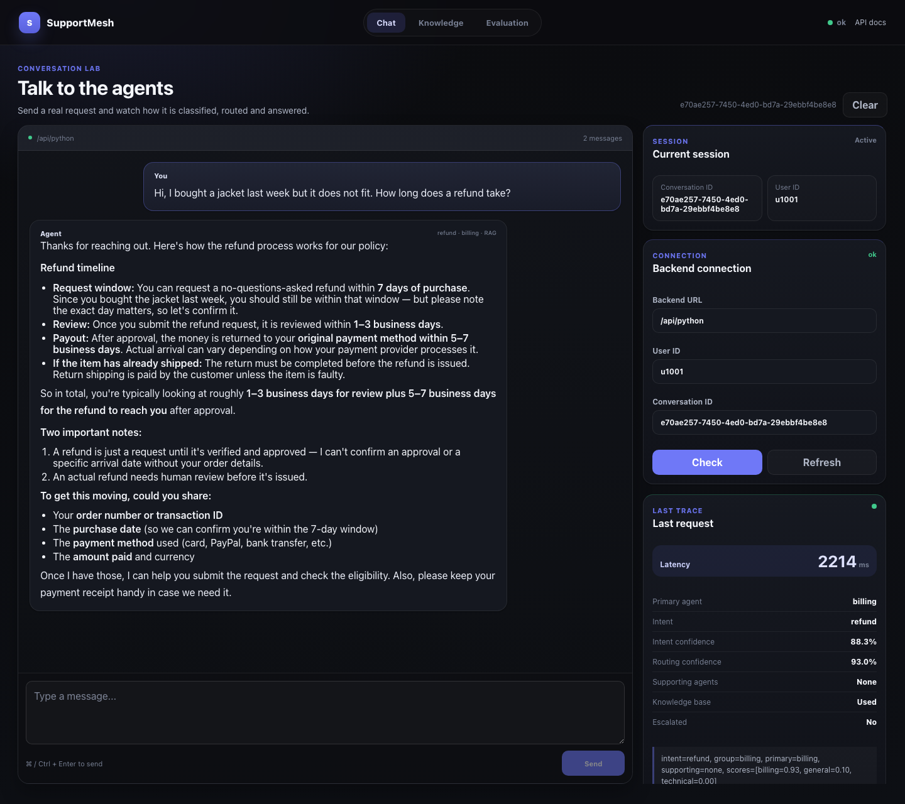
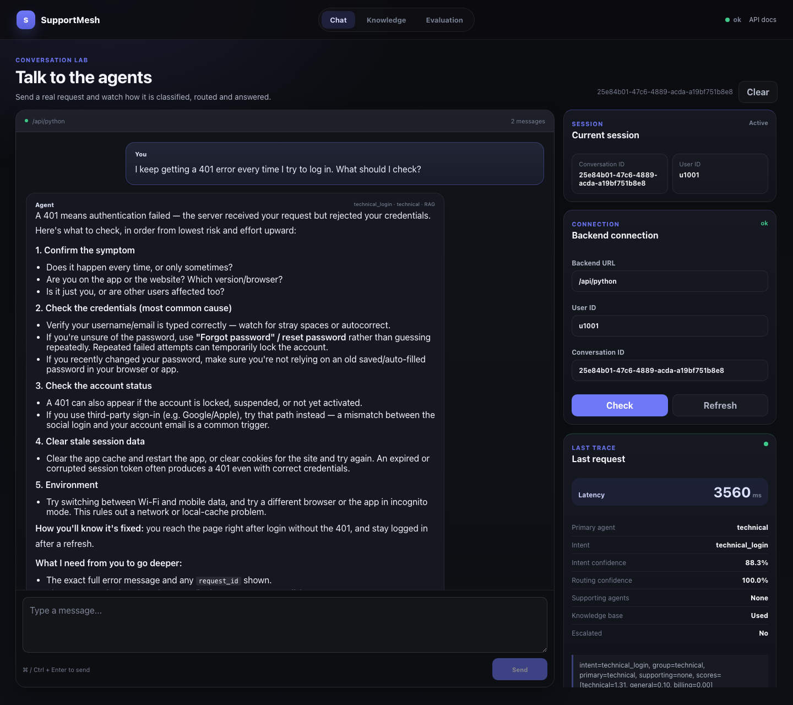
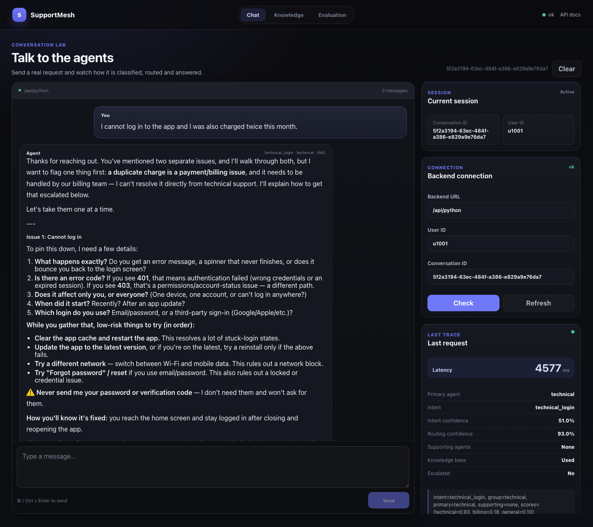
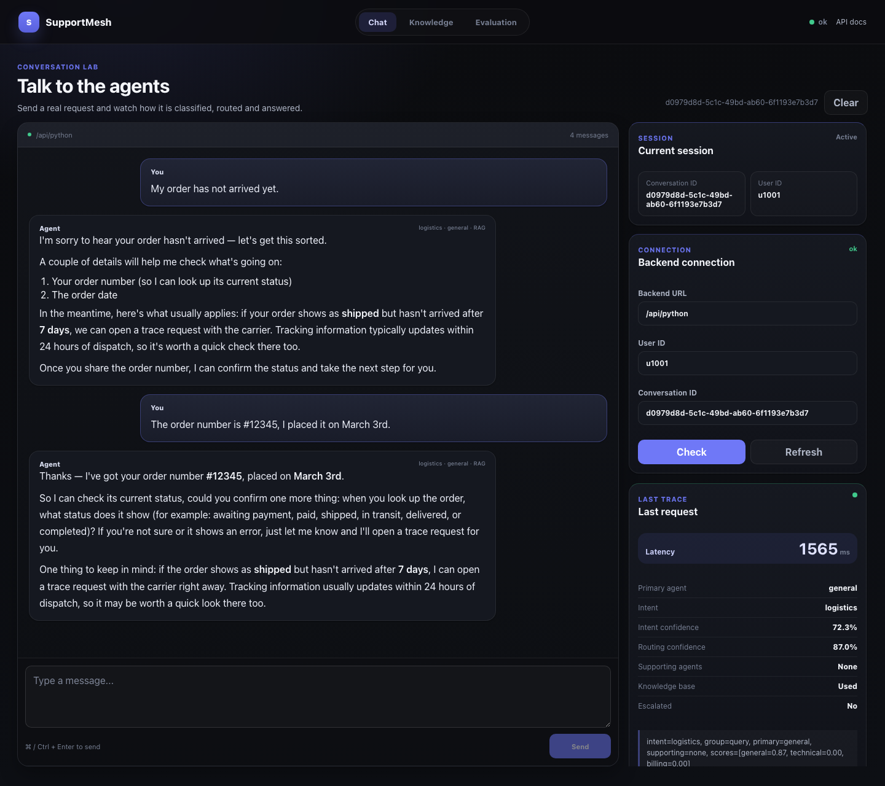

<div align="right">
  <a href="README.md"></a>
  <a href="README.ja.md"></a>
</div>

# SupportMesh

大規模言語モデルを基盤としたエンタープライズ向けカスタマーサポートシステムです。
問い合わせを分類し、専門エージェントへ振り分け、ナレッジベースからの検索に基づいて回答し、
会話をまたいで記憶します。監視と評価は後付けではなく、最初から組み込まれています。

```text
ユーザーからの問い合わせ
  -> MemoryManager     Redis のワーキングメモリ、ChromaDB のエピソード記憶とユーザープロファイルを読み込む
  -> IntentRecognizer  意図を分類する（LLM + 埋め込み + キーワードパターン）
  -> KnowledgeBase     クエリを書き換え、並列に想起し、LLM で再ランキングする
  -> AgentOrchestrator General / Technical / Billing のいずれかのエージェントへ振り分ける
  -> LLM               該当する Skills を注入したうえで回答を生成する
  -> MemoryManager     ターンを書き戻し、ユーザープロファイルを非同期に更新する
```

## 動作画面

コンソール上での実際の実行例を 4 つ示します。各スクリーンショットには、質問、回答、
そしてバックエンドが選択したルーティングを示す右側のトレースパネルが写っています。

### 返金に関する質問

`refund` 意図と判定され、Billing エージェントへ振り分けられ、ナレッジベースから回答されています。
回答は返金ポリシーの範囲内に留まり（7 日間の申請期間、1〜3 営業日の審査、
元の決済手段への 5〜7 営業日での返金）、結果を約束することは拒否します。
Billing の Skill がそれを禁じているためです。



### ログイン失敗

`technical_login` 意図と判定され、Technical エージェントへ振り分けられています。
低リスクの確認手順を列挙する前に 401 が実際に何を意味するのかを説明し、
推測で答えるのではなく必要な情報を尋ね返しています。



### 複合的な問題

「ログインできず、しかも二重に請求されている」という問い合わせです。ルーターは technical に 0.93、
billing に 0.18 のスコアを付け、Technical エージェント単独へ送りました。
エージェントは請求側の論点に踏み込んで回答するのではなく、二重請求を自分の担当範囲外として明示し、
エスカレーションの方法を説明します。この境界はモデルの裁量ではなく、Technical の Skill に由来します。



### ターンをまたいだ記憶

同一会話における 2 ターンの例です。顧客は 2 通目で初めて注文番号を伝えますが、
1 ターン目のワーキングメモリがプロンプトへ再投入されるため、
回答は注文日とあわせて注文番号を引き継いでいます。



## 構成

```text
backend/     FastAPI サービス — エージェント、メモリ、検索、監視、評価
frontend/    バックエンドを操作し、その判断過程を観察するための Vue 3 コンソール
```

各ディレクトリはそれぞれ README を持ちます。[backend/README.md](backend/README.md) が
運用ガイドの全体、[frontend/README.md](frontend/README.md) がコンソールの説明です。

## バックエンドの構成要素

| モジュール | 役割 |
|---|---|
| `api/main.py` | FastAPI のエントリーポイント。全コンポーネントを結線する |
| `core/intent_recognizer.py` | 3 系統の意図認識：LLM による意味解析（70%）、埋め込み類似度（20%）、キーワードパターン（10%）を加重投票で統合 |
| `agents/agent_orchestrator.py` | 意図によるルーティング、次いで実行時パフォーマンスによるルーティングとフォールバック。複合的な質問には並列協調で対応 |
| `agents/tools.py` | 決定的なエージェントツール（オーケストレーターへは未接続） |
| `memory/conversation_memory.py` | 3 階層構成：Redis のワーキングメモリ、ChromaDB のエピソード記憶、ChromaDB のユーザープロファイル。自動圧縮付き |
| `mcp/tool_manager.py` | クエリ書き換え、LLM による再ランキング、サーキットブレーカー、TTL キャッシュ、フォールバックを備えたツール呼び出し |
| `mcp/knowledge_base.py` | ChromaDB 上の RAG |
| `monitor/performance_monitor.py` | リアルタイム指標、Z スコアによる異常検知、アラート、オーケストレーターへ返すルーティングペナルティ |
| `evaluation/evaluator.py` | 意図分類精度、LLM-as-Judge による対話スコアリング、ベースラインに対する劣化検知 |
| `skills/` | エージェントのシステムプロンプトへ注入される、ホットリロード可能な業務ルール |

## 動作要件

- Python 3.12 以上
- Node 20.19 以上、または 22.12 以上（Vite 7 の要件）
- Docker（Redis と ChromaDB 用）
- Anthropic API キー、または DeepSeek などの Anthropic 互換 API のキー

## クイックスタート

依存サービスを起動します。

```bash
cd backend
docker compose up -d redis chromadb
```

バックエンドを設定して起動します。

```bash
cp .env.example .env        # その後 ANTHROPIC_API_KEY を設定する
python -m venv .venv && .venv/bin/pip install -r requirements.txt
.venv/bin/python -m uvicorn api.main:app --host 127.0.0.1 --port 8000
```

コンソールを起動します。

```bash
cd ../frontend
npm install
npm run dev
```

http://localhost:5173 を開いてください。バックエンドは http://localhost:8000 で応答し、
対話的な API ドキュメントは `/docs` にあります。

## Docker によるフルスタック起動

```bash
cd backend
docker compose up -d --build
```

| サービス | ホスト側ポート | 用途 |
|---|---|---|
| supportmesh | 8000 | API |
| nginx | 80 | リバースプロキシ |
| chromadb | 8001 | ベクトルストア |
| redis | 6379 | ワーキングメモリ |
| prometheus | 9090 | メトリクスの保存 |

この構成では `.env` に `CHROMA_HOST=chromadb` と `CHROMA_PORT=8000` を設定してください。
コンテナ内の `localhost` はそのコンテナ自身を指すためです。

## API

| メソッド | パス | 用途 |
|---|---|---|
| `POST` | `/chat` | 主要な対話エンドポイント |
| `POST` | `/search` | 検索のみ：書き換え、想起、再ランキング |
| `GET` | `/health` | 稼働状態とエージェントごとの統計 |
| `GET` | `/monitor` | エージェントとツールの統計、アラート、改善提案 |
| `GET` | `/metrics` | Prometheus 形式のメトリクス |
| `GET` | `/skills`, `POST` `/skills/reload` | 業務ルールの参照とホットリロード |
| `POST` | `/knowledge/add`, `/knowledge/upload` | ドキュメントの取り込み |
| `GET` | `/knowledge/stats` | チャンク数 |
| `POST` | `/eval/run` | 組み込み評価の実行 |

## 設定

`backend/.env.example` に、コードが読み取るすべての変数とその既定値を記載しています。
必須なのは `ANTHROPIC_API_KEY` のみで、これがない場合サービスは起動しません。
Anthropic の代わりに互換プロバイダーを使う場合は `ANTHROPIC_BASE_URL` をそちらへ向けてください。

Skills は `backend/skills/` 配下に、フロントマター付きの Markdown として置かれています。
ファイルを編集して `POST /skills/reload` を呼べば反映され、再起動は不要です。
